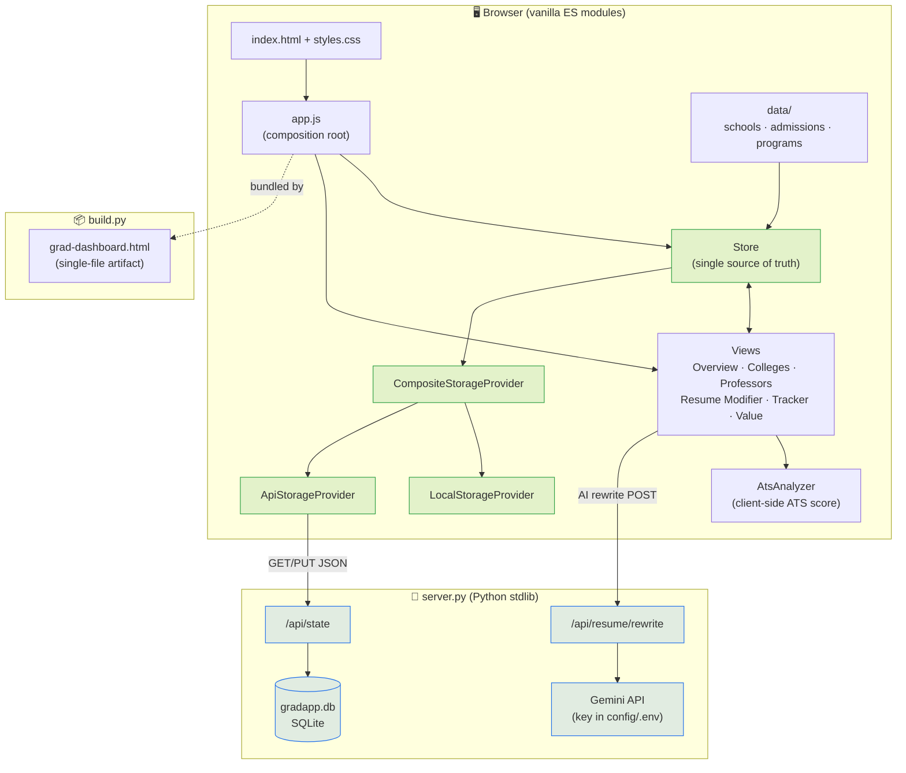

# MlProject1 — MS Fall 2027 Application Dashboard & Resume Tooling

Personal tooling for planning US graduate-school (MS, AI/ML/CS) applications for Fall 2027,
plus ATS-friendly resume generation. It's a **modular vanilla-JS web app** (no framework, no
npm) backed by a small Python standard-library server, alongside a couple of standalone Python
resume builders.

Everything runs with the system `python3` — there is **no build toolchain, no `node`, no
package install** for the app itself.


> _Portal running locally at `http://127.0.0.1:8500`._

---

## What's inside

The dashboard has six tabs:

| Tab | What it does |
| --- | --- |
| **Overview** | At-a-glance summary of the application plan and progress. |
| **Top 50 Colleges** | Ranked target schools with tuition, deadlines, and admit-rate estimates (verified vs. estimated figures are labelled). |
| **Professors & Outreach** | Faculty to email, with a draft-email modal and Google Scholar lookup links. |
| **Resume Modifier** | ATS score (client-side) + optional AI rewrite (server + Gemini API). |
| **Application Tracker** | Per-school status, notes, and a checklist. |
| **Best Under $30K** | Value picks by total cost. |

Your per-school state (`status`, `notes`, `checks`) persists automatically — to a local SQLite
DB when the server is running, and to `localStorage` otherwise.

---

## Requirements

- **Python 3** (the machine's system `python3` / Anaconda is fine).
- Python packages **only for the resume scripts**: `python-docx`, `reportlab`, `pdfplumber`.
  The dashboard and server use the standard library only.
- **A Gemini API key** — optional, and only for the Resume Modifier's *AI rewrite*. Everything
  else (including the ATS score) works with no key.

---

## Quick start

```bash
./setup
```

This checks for Python, prompts once for an API key, builds the bundle, and launches the server
with your browser pointed at <http://127.0.0.1:8500>.

> **Heads-up:** the current `./setup` script is out of date — it asks for an *Anthropic* key and
> writes it to a root `.env`, but the server now uses **Gemini** and reads `config/.env`. Until
> that's fixed, use the **Manual start** below to enable AI rewrite (ATS scoring works either
> way).

### Manual start

```bash
# 1. (optional) Build the single-file artifact bundle from src/
python3 build.py

# 2. Start the server (serves index.html + the API on port 8500)
python3 server.py

# 3. Open the dashboard
open http://127.0.0.1:8500      # macOS
```

Always open it over **HTTP** — direct `file://` access is blocked because the app loads ES
modules.

### Enabling the AI rewrite (optional)

The AI rewrite calls the Gemini API, and the key is kept **server-side only** (never in the
browser or the published artifact). Add it to a gitignored env file:

```bash
mkdir -p config
echo 'GEMINI_API_KEY=your-key-here' >> config/.env
chmod 600 config/.env
# optional: override the model (defaults to gemini-2.0-flash)
# echo 'GEMINI_MODEL=gemini-2.0-flash' >> config/.env
```

Get a key at <https://aistudio.google.com/app/apikey>, then restart `server.py` — it prints
whether `GEMINI_API_KEY` is configured on startup. Without a key the ATS score still works
fully; the AI rewrite shows a clear on-screen message instead.

---

## Two ways the app runs

1. **Local app (source of truth).** `python3 server.py` serves `index.html`, which loads
   `styles.css` and `src/app.js` as ES modules. This is where you edit code and where SQLite
   persistence works.
2. **Single-file artifact.** `python3 build.py` bundles `styles.css` + every `src/*.js` (imports
   stripped, in dependency order) into `grad-dashboard.html` — a self-contained file for sharing
   as a Claude Artifact. It has no server, so it falls back to `localStorage` and can't do AI
   rewrite.

**Edit `src/`, never `grad-dashboard.html` directly** — the latter is generated by `build.py`.

---

## Architecture



- **Data is pure** and flows into the `Store`, the single source of truth.
- **Views subscribe** to typed store changes — each owns one DOM region.
- **Storage is swappable** via `CompositeStorageProvider`: local SQLite (through the server) is
  preferred, with `localStorage` as an automatic fallback when no server is running.
- **The server** is optional for browsing — it only adds durable persistence and the Gemini-backed
  AI rewrite. The bundled `grad-dashboard.html` artifact runs entirely in the browser.

---

## Project layout

```
index.html            Full HTML doc for local serving
styles.css            Theme tokens + component styles (light/dark aware)
server.py             Stdlib HTTP server: static files + /api/state + /api/resume/rewrite
build.py              Bundles src/ + styles.css -> grad-dashboard.html
grad-dashboard.html   Generated single-file artifact (do not edit by hand)
setup                 Convenience launcher (see heads-up above)
config/.env           Gitignored — holds GEMINI_API_KEY
gradapp.db            Gitignored — SQLite persistence for your app state

src/
  data/       Pure data: schools, value picks, admissions, programs, checklist
  core/       dom / format helpers, presenters, Store (single source of truth)
  storage/    StorageProvider base + LocalStorage / Api / Composite providers
  services/   AtsAnalyzer, ResumeRewriteService, ScholarLinkService, EmailComposer
  views/      One view per DOM region (tabs, modals), each reacts to store changes
  app.js      Composition root: builds storage -> store -> views, wires deps

resume/
  build_resume.py       python-docx -> ~/Downloads/NikitaSingh_Resume_Updated.docx
  build_resume_pdf.py   reportlab   -> ~/Downloads/NikitaSingh_Resume_Updated.pdf
```

The architecture is intentionally SOLID: data is pure, the `Store` is the single source of
truth, views subscribe to typed changes, and storage backends are swappable via
`CompositeStorageProvider` (local SQLite preferred, `localStorage` fallback).

See **CODE_UNDERSTANDING.md** for a function-level map of the whole repo, and **CLAUDE.md** for
working conventions.

---

## Resume generators

Two standalone scripts, each holding its content inline (edit the bullets in the script, then
re-run):

```bash
python3 resume/build_resume.py       # -> ~/Downloads/NikitaSingh_Resume_Updated.docx
python3 resume/build_resume_pdf.py   # -> ~/Downloads/NikitaSingh_Resume_Updated.pdf
```

The PDF is built **directly** with reportlab (not converted from the docx) because
Pages/LibreOffice exports mangle text extraction and break ATS parsing. It uses Helvetica with
hyphen bullets so the extracted text stays clean — verify with `pdfplumber` that the output
contains no `(cid:` artifacts.

---

## Notes on accuracy & privacy

- All figures (tuition, deadlines, admit %) are **estimates for Fall-2027 planning**; the UI
  labels verified vs. estimated data. No tool can guarantee a universal "ATS score" — treat the
  number as a compatibility estimate, not a promise.
- Secrets (`config/.env`), your app data (`gradapp.db`), and caches are **gitignored** — never
  committed, never shipped in the public artifact.
